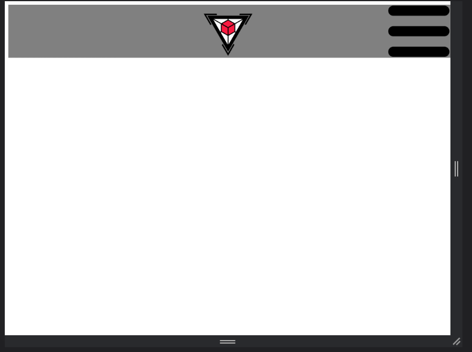
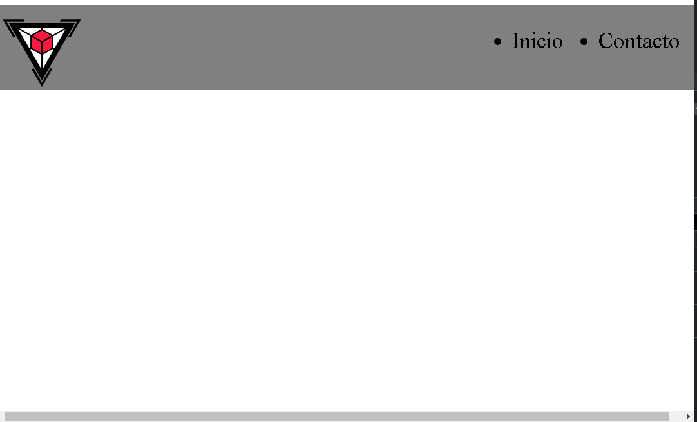

Menu hamburguesa
Evidencia en movil

Evidencia en web

Codigo html
~~~
<!DOCTYPE html>
<html lang="en">
<head>
    <meta charset="UTF-8">
    <meta name="viewport" content="width=device-width, initial-scale=1.0">
    <link rel="stylesheet" href="style.css">
    <title>Document</title>
</head>
<body>
    <main>
        <header>
            
            <ul>
                <li> Inicio </li>
                <li> Contacto </li>
                
            </ul>
            
        </header>
    </main>
</body>
</html>
~~~

Codigo CSS
~~~
header{
    width: 1000px;
    display: flex;
    height: 120px;
    background-color: grey;
}

ul{
    display: flex;
    width: 800px;
    gap: 50px;
    font-size: 32px;
    justify-content: flex-end;
}
.hamburguesa{
    display: none;
}
@media (max-width: 400px) {
    ul{
        display: none;
    }
    header{
        display: flex;
        justify-content: flex-end;
        gap: 300px;
    }
    .hamburguesa{
        display: flex;
        

        
    }
}
~~~

